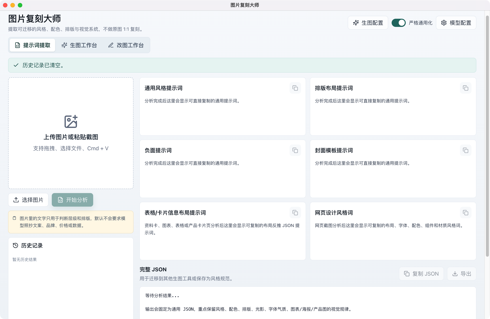

# 图片复刻大师

图片复刻大师是一个本地 Electron 桌面应用，把图片工作流串成三段：**提示词提取 → 生图 → 改图**。

它可以把上传、拖拽或粘贴的图片解析为可迁移的视觉风格 JSON 和中文提示词模板，再把这些提示词导入内置生图工作台生成图片，最后用改图工作台对单张图片做标注式局部修改。项目关注配色、排版、视觉层级、光影、材质、字体气质、信息布局和可编辑占位符，不用于 1:1 复制原图文字、品牌、价格、型号或数据。

如果需要分析网页或应用界面，可以先截图，然后直接粘贴或上传到应用中分析。项目不包含 Chrome 浏览器插件或自动网页采集服务。

## 当前版本：v1.1.6

- 识图新增 Anthropic Messages 协议，可接入使用 `ANTHROPIC_BASE_URL`、`ANTHROPIC_AUTH_TOKEN` 和自定义模型名的 Claude Code 兼容中转。
- Anthropic Messages 会从平台根地址拼接 `/v1/messages`，以 Bearer token 认证，并使用原生 base64 图片内容块和文本响应格式。
- 同步刷新 Apple Silicon macOS 与 Windows x64 本地安装包。

### v1.1.5

- 识图新增 OpenAI Responses 和 Gemini 原生 `generateContent` 协议，并保留 OpenAI Chat Completions 兼容方式。
- 生图与改图新增 Gemini 原生协议，并支持 OpenAI-compatible Images、Responses 和 Chat Completions。
- 配置界面把认证方式和调用协议分开显示，并为各协议补充简短的选择说明。
- 同步刷新 Apple Silicon macOS 与 Windows x64 本地安装包，避免旧版界面与新版协议配置混用。

### v1.1.4

- Windows 改图清单会把纯删除文字正确识别为删除操作，不再因缺少“新文字”而禁用确认按钮。
- macOS 现有确认门禁和改图流程保持不变。

### v1.1.3

- 改图标注解析会先压缩待修改图和编号定位图，再发送给视觉模型，避免高分辨率 PNG 双图请求长时间无响应。
- 标注解析单独使用 120 秒超时和受限输出长度；失败生成的手工清单不再占用成功缓存，可以直接重试。
- 标注解析成功缓存会区分 API Base URL 和模型名称，切换视觉模型后不会错误复用旧模型结果。

### v1.1.2

- 新增 Windows x64 中文 NSIS 安装器，同时保留便携 ZIP；安装器支持按用户安装、选择安装位置、开始菜单快捷方式和标准卸载入口。
- Windows 下的粘贴提示改为 `Ctrl + V`，应用菜单改为中文，Codex 请求会报告真实 Windows/x64 客户端信息。
- “抹除全部本机数据”在 Windows 下新增 Cookie、Local Storage、HTTP/代码缓存、认证缓存和主机解析缓存清理。
- 新增 Windows 原生 CI、Electron 桌面端 E2E、PE 架构与版本检查、SHA-256 清单生成和可选 Authenticode 强制验签。
- macOS 现有功能、界面结构、菜单和本机清理行为保持不变。

### v1.1.1

- 改图任务区支持一键收起或展开当前列表中的已完成任务，同时保留单张任务卡的独立控制。
- 修改清单中的“必须保留项”和“空间锚点”支持按回车逐行填写，确认时会自动清理空行。
- 空间锚点明确为选填项；原文字和新文字只在换字时成对填写，最终提示词会明确要求只保留替换后的新文字。
- 同步更新 Apple Silicon macOS 与 Windows x64 安装包，安装包内包含本次最新界面和改图逻辑。

### v1.1.0

- 改图工作台统一使用“原始素材重新生成修订版”：先解析编号修改清单，再结合第一次生图提示词和原始参考图生成候选修订图。
- 精简改图界面和任务信息，只保留当前流程需要的操作、状态与结果展示。
- 保留 1-4 张候选图、任务队列、重试、对比、下载和继续改图等完整工作流。
- 同步提供 Apple Silicon macOS 与 Windows x64 安装包；源码依赖、构建产物和本机任务数据不进入 Git 仓库。

改图采用模型重新生成而不是像素级局部修补，因此能避免反复编辑整张成品图带来的脏纹，但不能保证未指定区域完全不变。

## 功能概览



### 1. 提示词提取工作台

- 支持本地图片选择、拖拽上传和 macOS 截图后直接粘贴。
- 识别产品图、海报、图表/仪表盘、资料卡、社交媒体封面、摄影、插画、UI 截图和混合版式。
- 输出可迁移的视觉风格 JSON、通用风格提示词、排版提示词、配色提示词、光影提示词、字体提示词、负面提示词和可编辑模板。
- 对图表、表格、资料卡、产品参数页、小红书笔记型信息页输出信息布局模板，用于复用卡片/表格结构和文字层级。
- 对含文字图片提供“图中文字（Markdown）”面板，按视觉层级转写可读文字，方便用户后续编辑；普通风格提示词仍不会默认照抄原文案。
- 支持主体参考图融合：保留主体图中的主要人物或物体，把已解析出的视觉风格、服装造型、发型质感或姿态动作按开关代入，生成可复制的中文融合提示词和结构化融合 JSON。
- 支持产品信息布局融合：把用户输入的新产品文字或产品信息图适配进已解析出的资料卡、表格或信息页版式。
- 支持历史记录回填、单条删除、JSON 导出和本机数据清理。

### 2. 生图工作台

- 普通图片解析后，可把当前“图中文字（Markdown）”编辑稿与视觉风格、版式和负面约束合成为“完整文生图提示词”；也可直接手动填写提示词。两种方式都只在生图域创建可编辑副本，不反写原始分析 JSON、融合 JSON 或图片分析历史。
- 不上传参考图时可做文生图；上传、拖拽或粘贴参考图后可做参考图生成或图像编辑。
- 支持 1K / 2K / 4K 分辨率档位，以及 `1:1`、`4:5`、`5:4`、`3:4`、`4:3`、`2:3`、`3:2`、`9:16`、`16:9`、`9:21`、`21:9` 等比例，并会解析为真实请求尺寸。
- 支持提示词模式、质量、数量、输出格式、压缩、背景和审核强度等参数。
- 支持参考图轻量编辑：中心裁切、90 度旋转、缩放、简单擦除，以及多张参考图合成为一张。
- 支持任务队列、并发上限、取消、重试、状态回看、按提示词/来源/状态/时间筛选、归档、隐藏和恢复显示。
- 支持全屏预览、点击局部放大、原始提取图/生成图左右对比、单张下载、批量下载和复制最终提示词。
- 生成图可以一键“去改图”，作为改图工作台的单源图继续处理。

### 3. 改图工作台

- 用于单源图局部或定向修改，支持直接上传、拖拽、粘贴，或从生图输出进入。
- 提供画笔、箭头、框选、文字批注、撤销和清空。
- 多处修改会自动生成编号；视觉模型先解析修改对象、目标和保留项，用户逐项确认后才能生成。
- 从生图输出进入时，会继承第一次生图的提示词和原始参考图；当前生成图和编号定位图只用于理解修改意图，不作为最终图像生成输入。
- 最终使用已确认清单、第一次生图提示词和原始参考图重新生成 1-4 张候选修订图，减少二次提交整张成品图造成的纹理污染。
- 支持任务队列、取消、重试、隐藏、恢复显示、删除、清空、任务卡收起/展开、全屏预览、源图/改图输出左右对比、单张下载、批量下载和继续改图。

## 快速使用流程

### 下载 App

从 [Releases](https://github.com/Timyangyh/image-style-prompt-extractor/releases) 下载对应系统的包：

- M 系列 Mac：`image-style-prompt-extractor-mac-arm64.zip`
- Windows 10 / 11 x64 安装版：`image-style-prompt-extractor-win-setup-<version>-x64.exe`
- Windows 10 / 11 x64 便携版：`image-style-prompt-extractor-win-portable-<version>-x64.zip`

Mac 使用方式：

1. 解压 zip。
2. 打开 `图片复刻大师.app`。
3. 首次使用在“模型配置”里填写图片分析模型的 API Base URL、Model Name 和 API Key。

如果 macOS 阻止打开，先右键点击 App，选择“打开”。如果仍无法打开，可以把 App 放到“应用程序”后执行：

```bash
APP="/Applications/图片复刻大师.app"
xattr -dr com.apple.quarantine "$APP"
codesign --force --deep --sign - "$APP"
open "$APP"
```

Windows 安装版使用方式（推荐）：

1. 下载 `image-style-prompt-extractor-win-setup-<version>-x64.exe`。
2. 启动安装器，按需选择仅为当前用户安装和安装位置。
3. 从开始菜单或桌面快捷方式打开“图片复刻大师”。
4. 首次使用在“模型配置”里填写图片分析模型的 API Base URL、Model Name 和 API Key。

Windows 便携版使用方式：

1. 解压 `image-style-prompt-extractor-win-portable-<version>-x64.zip`。
2. 打开解压后的 `image-style-prompt-extractor.exe`。
3. 首次使用在“模型配置”里填写图片分析模型的 API Base URL、Model Name 和 API Key。

Windows 包当前未做商业代码签名。下载后可使用 Release 附带的 `SHA256SUMS.txt` 核对文件；便携版请先解压再运行，不要直接在压缩包预览窗口里打开 exe。首次运行时可能遇到几种系统安全提示：

- 如果出现 Microsoft Defender SmartScreen 的“Windows 已保护你的电脑”蓝色弹窗，确认来源是本仓库 Release 后，可以点击“更多信息”，再选择“仍要运行”。
- 如果没有出现弹窗、双击后没有反应，或没有“仍要运行”按钮，请右键点击 `image-style-prompt-extractor.exe`，打开“属性”，在“常规”页查看是否有“解除锁定 / Unblock”选项；如果有，勾选后点击“应用”，再重新运行。
- 公司或学校管理的 Windows 设备可能通过策略禁止绕过 SmartScreen，这种情况下需要联系设备管理员，或换用个人设备运行。

### 配置模型

图片分析流程可在“模型配置”中选择平台实际提供的识图协议：

- OpenAI-compatible Chat Completions，多数兼容平台使用。
- OpenAI Responses，多模态输入使用 `/responses` 的平台使用。
- Anthropic Messages，使用 `ANTHROPIC_BASE_URL` 和 `ANTHROPIC_AUTH_TOKEN` 的 Claude Code 兼容中转使用。
- Gemini 原生 `generateContent`，Google Gemini 官方或兼容中转平台使用。

选择协议后填写：

- API Base URL，例如 `https://api.openai.com/v1`
- Model Name，例如 `gpt-4o-mini`
- API Key

Claude Code 兼容中转的配置映射为：

- `ANTHROPIC_BASE_URL` 填入 API Base URL；根地址和以 `/v1` 结尾的地址均可，应用会拼接 `/v1/messages`。
- `ANTHROPIC_MODEL` 或平台给出的模型名填入 Model Name，并确认该模型具备图片理解能力。
- `ANTHROPIC_AUTH_TOKEN` 填入 API Key；应用只在 Electron 主进程中以 `Authorization: Bearer` 发送。

生图工作台和改图工作台使用独立的“生图配置”，可选择：

- Codex OAuth 本机登录：复用本机 `codex login` 状态，页面只显示是否可用，不接触明文 token。
- OpenAI-compatible Images API。
- OpenAI-compatible Responses 图像工具。
- OpenAI-compatible Chat Completions 生图接口。
- Gemini 原生 `generateContent` 生图/改图接口。
- OpenRouter Images API 供应商。

API Key 和 OAuth token 只应在 Electron 主进程和本机配置中使用，不应提交到仓库、issue、日志或截图。

### 提取提示词

1. 在“提示词提取”页上传、拖拽或粘贴图片。
2. 点击分析，等待视觉风格 JSON 和中文提示词生成。
3. 复制需要的提示词，或导出 JSON。
4. 如果图片包含可读文字，可在“图中文字（Markdown）”面板编辑转写结果。
5. 如果需要保留人物/主体并迁移风格，进入“主体参考图融合”；如果是资料卡或产品信息页，进入“产品信息布局融合”。

### 直接生图

1. 普通图片解析完成后，可先编辑“图中文字（Markdown）”，再进入生图工作台点击“完整文生图提示词”；应用会合入当前文字编辑稿并清空生图参考图。也可不做图片解析，直接在生图工作台手动填写完整提示词。
2. 不上传参考图时按纯文生图提交，不需要融合提示词或主体参考图；需要保留指定人物、产品或物体时，才使用主体融合或主动添加参考图。
3. 按需编辑提示词，选择比例、分辨率和数量后点击开始生图。
4. 在任务卡中查看状态、预览结果和下载图片；只有带解析来源图的任务才提供原图/生成图左右对比。
5. 需要进一步修改时，点击生成图上的“去改图”。文生图结果会继续使用第一次生图提示词按纯文字策略重生成修订版。

### 局部改图

1. 在“改图工作台”导入单张源图，或从生图输出点击“去改图”进入。
2. 用画笔、箭头、框选或文字批注标出需要修改的位置。
3. 为每个编号填写对应修改要求，再补充整体改图说明。
4. 解析修改清单，逐项确认修改对象、目标和保留项。
5. 生成修订版后，在任务卡中查看候选图、左右对比、下载结果，或把某张输出继续作为下一轮源图。

## 能力边界

- 项目提取的是可迁移视觉风格和结构，不会把原图品牌、logo、价格、日期、型号或具体数据当作可复刻内容写进普通提示词。
- `extracted_text` 是专门的文字转写区；只有用户主动编辑并选择代入时，编辑稿才会成为后续融合画面的可见文字。
- 生图和改图任务保存在本机独立数据域，不写回图片分析历史。
- 改图工作台通过原始提示词和原始参考图重新生成修订版，不是像素级局部编辑；模型仍可能改变未指定区域，重要结果需要人工检查。

## 系统要求

- 下载 App：M 系列 Mac，或 Windows 10 / 11 x64。
- 源码运行：M 系列 Mac、Node.js 和 npm；Windows 源码运行需要自行安装 Node.js/npm 并使用命令行启动。
- 图片分析：可用的 Chat Completions、Responses、Anthropic Messages 或 Gemini 原生多模态模型 API。
- 应用内生图/改图：Codex OAuth、本机 OpenAI-compatible 图像 API 配置，或 OpenRouter Images API 配置。

`start.command` 和 `make-portable.command` 只面向 Apple Silicon Mac。Windows 用户优先下载 Release 中的 Windows x64 zip；如果从源码运行，不要使用这些 macOS 脚本。

## 源码运行

```bash
npm install
npm run dev
```

也可以在 M 系列 Mac 上双击：

```text
start.command
```

它会检查本机环境，准备项目依赖，然后启动开发版应用。

## 常用命令

```bash
npm run dev       # 启动开发版应用
npm run test:unit # 运行单元测试
npm run build     # TypeScript 与 Electron Vite 构建检查
npm run pack      # 生成未压缩 macOS app
npm run dist:mac  # 生成 macOS dmg / zip
npm run dist:win  # 生成 Windows x64 zip
```

## 安全

请通过 GitHub Security Advisories 报告安全问题。不要在公开 issue 中粘贴 API Key、OAuth token、cookie、私人截图、生成图片或本机运行数据。

详见 `SECURITY.md`。

## License

MIT License. See `LICENSE`.
